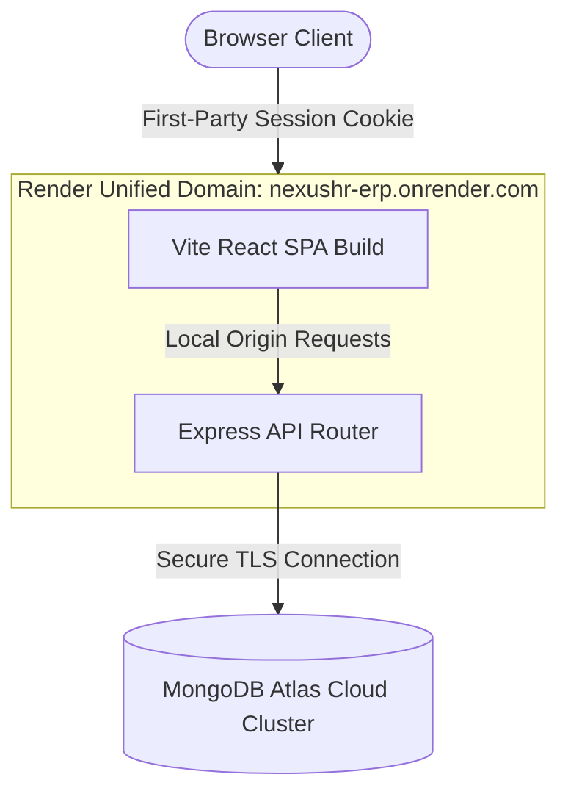

# 🌐 NexusHR ERP — Enterprise HR & Operations Platform

[](https://nexushr-erp.onrender.com)
[](https://vite.dev)
[](https://nodejs.org)
[](https://mongodb.com)

A next-generation, SaaS-grade Enterprise Resource Planning (ERP) and Human Resource Management platform built with the MERN stack. Designed with a clean, high-velocity minimalist aesthetic inspired by modern productivity interfaces.

👉 **Live Demo:** [https://nexushr-erp.onrender.com](https://nexushr-erp.onrender.com)

---

## 🚀 Key Features

*   **🔒 Secure RBAC Auth & Sessions:** Fully cookie-based session management using secure, HttpOnly, and cross-site enabled `express-session` storage.
*   **💼 Command Center & Employee Directory:** Real-time search, filters, department allocation, and deep analytics of company staff profiles.
*   **📊 Integrated Payroll Engine:** Calculate, verify, and track employee salary structures including basic salary, bonus packages, dynamic deductions, and net-pay outcomes.
*   **📅 Automated Leave Workflows:** Modern leave application interfaces with automatic calculation of sick, annual, and casual leave quotas. Supports multi-tier admin approvals.
*   **📢 Operational Bulletins:** Create and publish organization-wide announcements and alerts instantly.
*   **📜 Security Audit Log:** Immutable tracking system logging admin and employee operations for transparency and auditing.

---

## 🛠️ Tech Stack & Architecture



### **Frontend**
*   **Core:** React (Vite pipeline)
*   **Styling:** Tailwind CSS & Custom CSS Animations
*   **State & Navigation:** Context API & React Router DOM
*   **Icons:** Lucide React

### **Backend & Database**
*   **Runtime:** Node.js (Express framework)
*   **Authentication:** Cookie sessions (`express-session`)
*   **Database:** MongoDB Atlas (Mongoose ODM)

---

## ⚡ Quick Start (Local Setup)

### **Prerequisites**
*   Node.js (v18 or higher)
*   MongoDB Local Community Server or MongoDB Atlas account

### **1. Clone & Install Dependencies**
```bash
git clone https://github.com/abhimanyyadav/nexushr-erp.git
cd nexushr-erp

# Run the automated orchestrator to install dependencies for root, client, and server
npm run build
```

### **2. Configure Environment Variables**
Create a `.env` file inside the `server/` directory:
```env
PORT=8080
MONGO_URI=mongodb://127.0.0.1:27017/authDB
SESSION_SECRET=your_super_secret_local_key
NODE_ENV=development
```

### **3. Seed Demo Data**
To populate your database with 50 mock employees, department allocations, and leave histories:
```bash
node server/models/Seed.js
```

### **4. Run Locally**
*   **Backend Server:** `cd server && npm run dev` (Runs on `http://localhost:8080`)
*   **Frontend Client:** `cd client/client && npm run dev` (Runs on `http://localhost:5173`)

---

## 🔐 Credentials for Live Testing

Use these pre-seeded administrator credentials to access all dashboards on the [Live Site](https://nexushr-erp.onrender.com):

*   **Email:** `admin@test.com`
*   **Password:** `123456`

---

*Developed by Abhimanyu Yadav. Maintained for secure, dynamic enterprise operations.*
